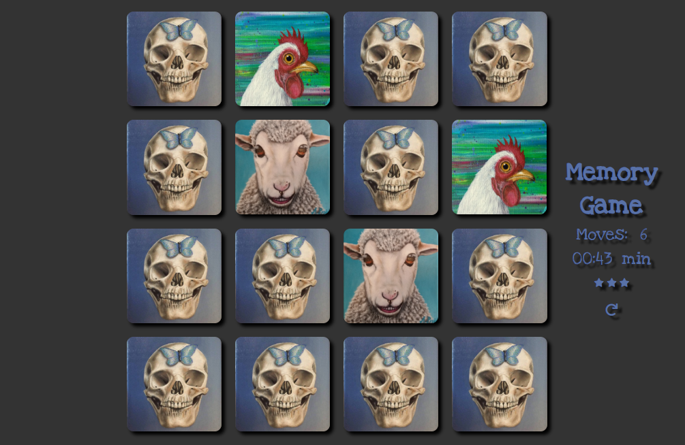

# Memory Game

This is a digital, one-player version of the game also known as Concentration, 
Match Match, Match Up, Memory, Pelmanism, Shinkei-suijaku, Pexeso or simply Pairs.
All of the cards are laid face down and two cards are clicked and flipped face up over each turn.
If they don't match they flip back. The object of the game is to find 8 pairs of matching cards 
in as few moves and as little time as possible.

## Installation

Clone the repo or download and unzip the zip file in any folder and open the index.html file in your browser.

## Resources

* Icons from [Font Awesome](https://fontawesome.com/icons?d=gallery).
* [Love Ya Like a Sister](https://fonts.google.com/specimen/Love+Ya+Like+A+Sister) font from Google Fonts 

## License

The content of this repository is licensed under an [MIT license](https://choosealicense.com/licenses/mit/)
